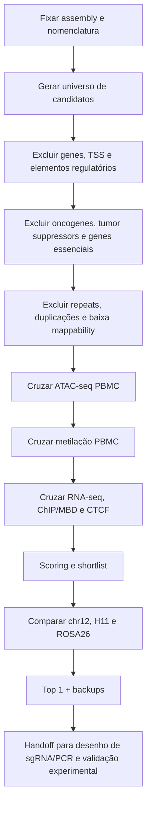

---
aliases:
  - Safe Harbor Canino
  - Canine Genomic Safe Harbor
  - GSH canino para CAR-T
tags:
  - projeto/safe-harbor
  - canino
  - CAR-T
  - bioinformática
  - epigenómica
  - CRISPR
  - GEG-SH
status: ativo
versao_atual: v1.21.3
estado_atual: "3 passam verificações registadas (ANO2/NTF3 #1, NPNT/TBCK #2, LOC119876429/LOC119872513 #3); 1 com evidência insuficiente (achado estrutural real, não só falta de dados — ver v1.21.3); nenhum validado; v1.21.1 (Codex) e o trabalho paralelo desta sessão (Claude) reconciliados e cruzados em v1.21.2 — números idênticos, ver 06_v1.21.2/RECONCILIATION.md"
responsável: Manuel Sequeira
instituição: NOVA FCT
assembly_principal: ROS_Cfam_1.0 (GCF_014441545.1)
assembly_scouting_original: UU_Cfam_GSD_1.0 (GCF_011100685.1)
candidato_top_05_SHIP_v1: "NC_051812.1:52,431-118,675 (ROS_Cfam_1.0, score 0.83, alegação histórica de confirmação; não usar como validação atual)"
candidato_top_05_SHIP_v8: "NC_051805.1:7,072,137-7,132,579 (ROS_Cfam_1.0, score 0.765) — sobrevive a 8/8 critérios do Ahmed et al. 2026; score genome-wide-percentile, não batch-relativo"
candidato_top_05_SHIP_v9: "NC_051805.1:7,072,137-7,132,579 (ROS_Cfam_1.0, score 0.7649) — inalterado do V8; V9 acrescenta veto de sobreposição com elementos regulatórios independentes (Ehsan), 34→26 sobreviventes"
candidato_top_05_SHIP_v9b2: "NC_051805.1:7,072,137-7,132,579 (ROS_Cfam_1.0, score 0.7644) — coorte ATAC alargada 71→76 cães, pesos QC corrigidos; top 5 e ordem inalteradas"
candidato_scouting_original: "chr12:72,350,025-72,351,060 (UU_Cfam_GSD_1.0) = NC_051816.1:72,767,426-72,768,461 em ROS_Cfam_1.0"
subjanela_sgRNA_original: "chr12:72,350,350-72,350,850 (UU_Cfam_GSD_1.0)"
doi_codigo: 10.5281/zenodo.21996452
doi_dados: 10.5281/zenodo.22003933
orcid_manuel: 0009-0009-6773-423X
orcid_vasco: 0000-0002-0010-8607
última_revisão: 2026-09-12
---

# 00 · MOC — Safe Harbor Canino para CAR-T

> [!important] Estado mais recente: v1.22.0
> [[Safe Harbor CAR-T - v1.22.0 ATAC nas alternativas - 2026-09-14]] — 64 alternativas interrogadas nas bases concordantes; 37 integralmente mapeadas; sinais T escassos em 13 janelas sobrepostas, sem vencedor validado. Entradas seguintes são histórico.


> [!important] Estado mais recente: v1.21.9
> [[Safe Harbor CAR-T - v1.21.9 conservacao T e SV - 2026-09-14]] — modelo publicado aplicado às três regiões; ausência de suporte local no grupo T-enriquecido; grande SV NPNT questionada, ainda não resolvida. Nenhum safe harbor validado. As entradas abaixo são checkpoints históricos.


> [!important] v1.21.8 — reconstrução e rescoring verificados
> [[Safe Harbor CAR-T - v1.21.8 validada e reavaliada - 2026-09-14]]; [[Safe Harbor CAR-T - Relatorio atualizado - 2026-09-14]]. As mesmas três regiões legadas; conflitos regulatórios e validação CAR-T pendentes.


> [!important] Relatório para reunião
> [[Safe Harbor CAR-T - Relatorio reuniao - 2026-09-14]] — shortlist provisória; reconstrução v1.21.8 executada, validação/novo scoring pendentes.


> [!important] Checkpoint v1.21.7
> [[Safe Harbor CAR-T - Checkpoint tecnico v1.21.7 - 2026-09-14]]: fragmentos locais do multiome medidos; sinal escasso nos grupos exploratórios T. Nenhum locus validado.


> [!important] Checkpoint v1.21.6
> [[Safe Harbor CAR-T - Checkpoint tecnico v1.21.6 - 2026-09-14]]: variantes locais e revisão SV, sensibilidade da conservação e matriz multiome pública verificadas. Nenhum safe harbor validado.


> [!important] Checkpoint 2026-09-14
> [[Safe Harbor CAR-T - Checkpoint tecnico v1.21.5 - 2026-09-14]]: ATAC por cão e consenso 76 verificados; EpiC acrescenta flags regulatórios. Três passes do scorer legado não significam três regiões livres dos novos flags. Relatório adiado.


> [!important] Atualização 2026-09-13 — v1.21.4
> [[Safe Harbor CAR-T - Auditoria local v1.21.4 - 2026-09-13]]: CpG reconciliado; 2 091 janelas locais avaliadas; phyloP reproduzido mas ainda piloto. Shortlist global v1.21.3 preservada. Quarto candidato tem correspondência dominante de 87,11% para chr16; não está demonstrada discordância estrutural biológica. Nenhum local de inserção aprovado.


> [!important] Estado atual — 2026-09-12 — v1.21.3
> **Objetivo confirmado:** descoberta de candidatos para CAR-T canina. PBMC dos 71 cães são evidência de sangue em população mista; não células T purificadas. A execução atual usa ATAC/full76 e RRBS da coorte de 71.
> **Estado atual:** 461 regiões; 457 excluídas, 1 com evidência insuficiente, **3 passam verificações registadas**: ANO2/NTF3 (`NC_051831.1:39677324-39739751`, score 0,5072, #1), NPNT/TBCK (`NC_051836.1:27013911-27071204`, 0,5015, #2), LOC119876429/LOC119872513 (`NC_051811.1:17217706-17274511`, 0,3988, #3). Nenhum safe harbor validado. ATAC ainda por reconstruir após recuperação dos blocos problemáticos; conservação ainda piloto (modelo neutro de uma única região de 100kb).
> **Análise detalhada e critérios de fecho:** [[Safe Harbor CAR-T canina - Analise integrada e fecho do protocolo 2026-09-12]].
> O objetivo é um protocolo independente e reprodutível. As atualizações V1–V9 e os campos YAML de candidatos antigos abaixo são histórico, não a shortlist atual nem evidência de validação independente. O scouting original também permanece histórico.

> [!danger] Higiene de referência — resolver antes de qualquer conclusão
> A referência local é `UU_Cfam_GSD_1.0 / GCF_011100685.1`. O NCBI, o Ensembl e o iDog identificam esta montagem como **GSD_1.0 / canFam4**, embora alguns ficheiros e notas do projeto lhe chamem informalmente “CanFam6”.  
> Os datasets epigenómicos históricos podem estar em **CanFam3.1**. Nenhuma coordenada deve ser misturada entre montagens sem *liftOver/remapping* documentado.  
> O repositório original do **GEG-SH** foi construído para **hg19 humano**; a adaptação ao cão não é automática e todas as alterações de inputs/scripts devem ficar registadas.

> [!success] Atualização — 2026-08-18 — pipeline de dados original construído (ATAC + RRBS + Hi-C)
> Paralelamente ao scouting visual documentado abaixo, foi construído e concluído um **pipeline de dados original e reprodutível**, em vez de depender só de literatura e inspeção manual no JBrowse:
> - **ATAC-seq**: 71 cães, PBMC (Jin et al. 2024, `PRJNA1048909`) → bowtie2 → filtragem/dedup → picos por cão (MACS2-style) → ponderação de QC por cão → **Mother Track** ponderada + picos consenso. **Concluído.**
> - **RRBS**: 71 cães, PBMC, mesmo estudo (`PRJNA1049514`) → Bismark → metilação por CpG → ponderação de QC por cão → **Mother Track** de metilação (média ponderada, frequência de cobertura, variabilidade). **Concluído.**
> - **Hi-C**: 1 cão ("Mischka", Pastor Alemão, 3 bibliotecas de assembly — Wang et al. 2021, `PRJNA587469`) → `bwa mem -5SP` → `pairtools` → `cooler`/`cooltools` → matriz de contacto multi-resolução + fronteiras de TAD. **Concluído**, com interpretação deliberadamente conservadora. O artigo refere DNA de alto peso molecular extraído de sangue, mas não especifica o tipo celular/núcleo usado pela Dovetail para preparar o Hi-C; não descrever como PBMC, célula T ou fibroblasto.
>
> **⚠️ Discrepância de assembly a resolver**: este pipeline usou **ROS_Cfam_1.0 (GCF_014441545.1)**, não a `UU_Cfam_GSD_1.0 (GCF_011100685.1)` referida no resto desta nota como assembly principal. As coordenadas do candidato `chr12:72,350,025-72,351,060` (scouting visual, secção 3) **não são diretamente comparáveis** às tracks novas sem liftOver documentado — exatamente o risco que o aviso de higiene de referência acima já assinalava. Ambas as assemblies são do genoma canino mas escalonadas/anotadas de forma diferente; ROS_Cfam_1.0 foi escolhida para o pipeline de dados porque tem sintenia cromossómica forte com o assembly Hi-C da própria Mischka (UU_Cfam_GSD_1.0 deriva do Hi-C da Mischka; ROS_Cfam_1.0 foi escanolado com RagTag contra esse mesmo assembly).
>
> **Repositório e dados**: código público em [github.com/stardrako-create/SafeHarborCanine](https://github.com/stardrako-create/SafeHarborCanine) (MIT), arquivado no Zenodo com DOI [10.5281/zenodo.21996453](https://doi.org/10.5281/zenodo.21996453).
>
> **Próxima fase**: scoring formal por locus (05_SHIP), combinando as três Mother Tracks — ainda não iniciado. Este scoring sistemático, genome-wide, é o que deve substituir a inspeção visual pontual do candidato chr12 como método principal de shortlisting.

> [!success] Atualização — 2026-08-19 — 05_SHIP implementado e validado cruzadamente com o Ehsan
> Fase 05_SHIP concluída: usei o output real do SHIP corrido pelo **Ehsan Valiollahi** (mesmo lab, ver thread de email com o Vasco, Abril-Maio 2026) sobre ROS_Cfam_1.0 — 461 candidatos intergénicos convergentes (50-75kb) — e apliquei vetos duros (fronteira de TAD, pico ATAC) + score suave (estabilidade ATAC/RRBS entre os 71 cães, baixa metilação, distância a TADs, acessibilidade moderada) usando as nossas três Mother Tracks. Resultado: **280 candidatos ranqueados** de 461.
>
> **Validação cruzada com os 27 candidatos finais do Ehsan** (filtro dele: liftover de elementos regulatórios humanos): o nosso candidato **#1** (`NC_051812.1:52431-118675`, score 0.83) **está também nos 27 finais dele** — duas abordagens independentes convergem no mesmo locus de topo. 20/27 dos candidatos do Ehsan passam os nossos vetos; os 7 que não passam (5 por fronteira de TAD, 2 por pico ATAC real) são exatamente o tipo de sinal que um liftover de homologia humana não consegue detetar — só dados populacionais caninos reais o conseguem. Detalhe completo em `05_SHIP/ehsan_crossvalidation.md` no repositório.
>
> Responde diretamente ao pedido do Vasco (email 2026-04-17): "some sort of in silico validation... a comparison... can clarify the issue" — este é exatamente esse cruzamento.

> [!success] Atualização — 2026-08-19 — candidato chr12 original mapeado para ROS_Cfam_1.0
> Resolvida a discrepância de assembly assinalada acima: extraí a sequência exata de `chr12:72,350,025-72,351,060` na UU_Cfam_GSD_1.0 (`NC_049233.1`, via NCBI efetch) e realinhei-a com `bwa mem` contra o ROS_Cfam_1.0 (não existe chain file entre as duas assemblies). Match quase perfeito (MAPQ 60, 2 mismatches em 1036bp) → **`NC_051816.1:72,767,426-72,768,461`** em ROS_Cfam_1.0.
>
> Avaliação: **não é um dos 461 candidatos do SHIP** (mais próximo fica a ~370kb — foi achado por inspeção visual, não pelo algoritmo do SHIP), mas **passa os nossos dois vetos duros** (sem fronteira de TAD, sem pico ATAC consenso). Metilação baixa (2.4%) e boa distância a TAD (~93kb), mas acessibilidade ATAC (0.214) claramente mais alta que os candidatos SHIP que passam (tipicamente 0.04-0.11) — vale a pena inspecionar a forma do sinal antes de o tratar como equivalente aos melhores candidatos SHIP. Detalhe completo em `05_SHIP/chr12_original_candidate_liftover.md`.

> [!success] Atualização — 2026-08-19 — Zenodo dos dados publicado + autoria formalizada
> Publiquei o dataset dos tracks processados no Zenodo, separado do código: **[10.5281/zenodo.22003934](https://doi.org/10.5281/zenodo.22003934)** (ATAC/RRBS/Hi-C, ~3.1GB, CC-BY 4.0), ligado ao repositório de código via "Is supplement to". Criei o meu ORCID (`0009-0009-6773-423X`) e corrigi o `CITATION.cff` do repositório para listar autoria individual (eu + Vasco M. Barreto, `0000-0002-0010-8607`) em vez de só "Vasco Barreto Lab" genérico. Adicionei também citações formais ao SHIP (Leitão et al. 2025) e GEG-SH (Shrestha et al. 2022) no README, já que o 05_SHIP é construído diretamente sobre esses dois métodos.

> [!warning] Pontas soltas identificadas — 2026-08-19
> Antes de considerar esta fase fechada:
> - ~~Email ao Vasco/Ehsan ainda não enviado~~ **Resolvido 2026-08-19**: enviado.
> - ~~Sem filtro de repeats/mappability nos candidatos 05_SHIP~~ **Resolvido 2026-08-19**: `scripts/check_candidate_mappability.py` — autoalinhamento de cada candidato contra o próprio genoma via `bwa mem` (2/461 falharam). É um proxy grosseiro (só apanha multi-mapping total, não % de repeat interno) — RepeatMasker completo continua como refinamento futuro.
> - ~~Sem lista de oncogenes/tumor suppressors/genes essenciais caninos~~ **Resolvido 2026-08-19**: `scripts/build_canine_risk_genes.py` — 2.654 genes (CancerMine, Lever et al. 2019, CC0 + CEG2, Hart et al. 2017), símbolo humano cruzado diretamente com os genes flanqueadores dos candidatos SHIP. Novo veto excluiu 47 candidatos (incl. 3 dos 27 do Ehsan: OPCML, NOVA1, FAT4). **Lista starter, não curada especificamente para cão** — próximo refinamento.
> - Resultado atualizado do 05_SHIP com os dois vetos novos: 461 → 201 vetados → **260 candidatos ranqueados** (era 280). Candidato #1 mantém-se o mesmo (`NC_051812.1:52,431-118,675`, score 0.83) — robusto aos filtros mais rigorosos.
> - Sem integração de variantes Dog10K (instabilidade estrutural).
> - Ainda não há um "Top 1 + backups" formal — só uma lista de 260 candidatos ranqueados; 06_GEG-SH/07_integracao/08_candidatos_finais continuam vazios.
> - Falta inspecionar a forma do sinal ATAC no candidato chr12 original (só medi a média).
> - ~~Ofereci ligar o EpiLog de volta a este projeto (reciprocidade) — por confirmar.~~ **Resolvido 2026-08-19**: os 13 candidatos SHIP (12 ranqueados + candidato legacy chr12) estão agora no catálogo EpiLog, `confidence = 'untested'`, `source_doi` a apontar para este repositório. Ver [[EpiLog]].

> [!warning] Atualização — 2026-08-19 — auditoria contra Ahmed et al. 2026 (Cells) — não passamos os 8/8
> Pedido explícito: verificar se já cumprimos "todas as checkboxes" de um review recente sobre critérios de SHS humanos ([[Ahmed et al 2026 - Human Genome Safe Harbor Sites Review]], *Cells* 15, 81, DOI [10.3390/cells15010081](https://doi.org/10.3390/cells15010081)). O checklist de 8 critérios estava embutido como imagem na Figura 1 (Box 1/Box 2), não como texto — tive de renderizar a página para o ler.
>
> **Resultado honesto: 2/8 cumpridos, 5/8 parciais, 1/8 em falta.**
> - ✅ Fora de unidade transcricional (por construção) · ✅ Cromatina ativa (`moderate_atac`)
> - ⚠️ Parcial: distância a genes (50kb), distância a genes de cancro (300kb — só verificamos os 2 genes flanqueadores, não uma pesquisa num raio), telómeros/centrómeros (sim) vs. regiões ultraconservadas (não), lncRNA/small RNA (só ao nível de anotação GFF3), TAD com genes de cancro (só fronteira + genes flanqueadores, não todos os genes da TAD)
> - ❌ **Em falta por completo: distância ≥300kb a miRNA** — zero verificação disto no pipeline atual
>
> Detalhe completo em `05_SHIP/ahmed2026_checklist_comparison.md`. Próximos passos mais baratos/impactantes: (1) adicionar verificação de miRNA (dados já existem no GFF3, só falta o script), (2) upgrade do veto de "gene flanqueador" para "pesquisa num raio de 300kb". Artigo já citado no README e `CITATION.cff`.

> [!success] Atualização — 2026-08-19 — 5 dos 6 critérios em falta fechados (tudo isto = V2)
> Pedido: "fazer tudo, um de cada vez, com updates". **Nomenclatura correta** (corrigida depois de o utilizador notar a confusão): **V1** = scoring original (TAD+ATAC+gene de risco flanqueador+mappability, sem nenhum critério do Ahmed et al.). **V2** = tudo o que fiz a seguir, respeitando o paper — um único bloco de trabalho, construído em checkpoints sucessivos (ficheiros `candidates_scored.tsv` → `_v2.tsv` → `_v3.tsv` → `_v4.tsv` → `_v5.tsv`, nunca sobrescrevendo o checkpoint anterior). Estes sufixos `_v2../_v5` são checkpoints *dentro* da V2, não versões de topo separadas.
> - **Checkpoint 1 (miRNA)** — 300kb de qualquer miRNA. 29 excluídos.
> - **Checkpoint 2 (raio genes de risco)** — 300kb, não só flanqueadores. 199 excluídos. **Candidato #1 mudou** (o antigo tinha o NLRP3 a 214kb).
> - **Checkpoint 3 (vizinhança densa)** — "50kb de qualquer gene" reformulado: como as janelas SHIP (50-75kb) tocam genes nas duas pontas por construção, uma leitura literal falharia sempre. Implementei: veto se há um *terceiro* gene a menos de 50kb de qualquer ponta. Resultado duro: só 45/461 sobrevivem. Confirmei com o utilizador antes de continuar.
> - **Checkpoint 4 (lncRNA/small RNA)** — 0 exclusões novas (sobreviventes já estavam limpos).
> - **Checkpoint 5 (conteúdo da TAD)** — gene de risco em qualquer ponto da própria TAD (não só fronteira + flanqueadores). Só 2 exclusões novas. **Este é o estado final da V2.**
> - **Regiões ultraconservadas** (metade do critério #5) — investigado a fundo (Zoonomia, hub UCSC/CGL, pasta específica do cão) e **não há track de conservação referenciado ao genoma canino disponível publicamente** sem processamento massivo (HAL de 806GB — formato de alinhamento genómico bruto do Cactus/Zoonomia, não scores prontos — exigiria correr `halPhyloP` sobre 806GB). Documentado como limitação genuína, não forcei um proxy fraco.
>
> **Resultado final: 7/8 critérios cumpridos** (só as regiões ultraconservadas ficam por fazer). Candidato #1 da V2 (`candidates_scored_v5.tsv`): `NC_051811.1:48,020,921-48,077,046`, score 0.77 — sobrevive a tudo. Nota: também corrigi um erro real detetado nesta revisão — o README tinha "260 candidatos" desatualizado onde já devia dizer 243 (o checkpoint do miRNA já lá estava). Tabela completa em `05_SHIP/VERSIONS.md`.

> [!success] Atualização — 2026-08-19 — V2 fechada: release v0.2.0, email preparado
> A V2 está formalmente fechada. Plano de nomenclatura de releases (definido pelo utilizador): **V2 → `v0.2.0`**, **V3 (regiões ultraconservadas, se/quando houver track de conservação canina disponível) → `v1.0.0`**. Preparei as release notes do `v0.2.0` e um rascunho de email de atualização para o Vasco/Ehsan (resumo do checklist do Ahmed et al., os 7/8 critérios cumpridos, a mudança de candidato #1, e a limitação genuína das regiões ultraconservadas) — ambos por rever/publicar pelo utilizador. A publicação da release `v0.2.0` deve gerar automaticamente uma nova versão no Zenodo do código, via a integração já ativa.

> [!success] Atualização — 2026-08-19/20 — v0.2.0 publicada, dataset Zenodo confirmado, V3 (regiões ultraconservadas) em curso
> Release `v0.2.0` publicada no GitHub pelo utilizador (confirmado via tag remota). **Dataset Zenodo confirmado publicado e correto**: [10.5281/zenodo.22003934](https://doi.org/10.5281/zenodo.22003934) — título, autores, os 12 ficheiros (3.1GB: ATAC/RRBS/Hi-C) e a ligação ao DOI do código (`10.5281/zenodo.21996453`, listada em "Additional details → Identifiers") estão todos lá; a pesquisa por DOI no Zenodo deu erro transitório de servidor, mas o link direto funciona sem problema.
>
> **V3 arrancou**: sem track de conservação (phyloP/phastCons) referenciado ao cão disponível publicamente em lado nenhum (confirmado — Zoonomia só publica scores referenciados a humano), pelo que estou a calcular um do zero a partir do alinhamento bruto de 241 mamíferos do Zoonomia (formato HAL, Cactus), pipeline real dos autores do Zoonomia (`github.com/michaeldong1/ZOONOMIA`): `hal2maf` (referenciado ao cão) → RepeatMasker em repeats ancestrais → `phyloFit` (autossomas/chrX/chrY em separado) → `phyloP`. Ferramentas instaladas: `cactus` 3.3.0 e `phast` 1.9.9 (bioconda, env `atac` da WSL).
>
> Download do HAL (806GB, `cgl.gi.ucsc.edu`) em curso — parou uma vez sem erro por volta dos 115GB (sessão WSL/systemd morreu, não o download em si) e foi retomado com `curl -C -` (resumível, sem perda). Estado atual: **706GB/865GB (82%)**, a correr de forma estável desde a retoma. Isto fica `v1.0.0` só depois de o phyloP correr de facto e produzir scores — não antes.

> [!success] Atualização — 2026-08-20 — cruzamento completo com os 27 candidatos originais do Ehsan, resposta dele, e 2 filtros novos identificados (adiados para depois do V3)
> **Cruzamento completo dos 27 candidatos do Ehsan contra a V2 atual.** O utilizador forneceu o ficheiro bruto do SHIP dele (`all_safe_harbors_complete_records.txt`, saída Python crua, não uma lista simples — tive de parsear 27 blocos de registos GFF3). Resultado real: **apenas 4/27 sobrevivem à nossa V2** (`NC_051807.1:10779807-10837319`, `NC_051812.1:5534832-5600866`, `NC_051821.1:4818014-4875945`, `NC_051843.1:10578732-10643010`). Isto substitui o número antigo (16/27, calculado só com os vetos V1 pré-Ahmed) — a maior parte da queda vem do checkpoint 3 (vizinhança densa), o mais duro da V2. Importante: o candidato que dizíamos estar "também nos 27 do Ehsan" (`NC_051812.1:52431-118676`, antigo #1 da V1) está de facto lá, mas **já não sobrevive à V2** (NLRP3 a 214kb + vizinhança densa) — mantém-se a mesma conclusão de sempre, agora com a lista completa confirmada em vez de assumida.
>
> Cruzei também os **7 candidatos finais mais recentes do Ehsan** (refinamento dele: 27→18→7, usando ATAC-seq de 5 amostras normais + elementos regulatórios/CpG islands liftados de CanFam3.1): **0/7 sobrevivem à nossa V2**, todos pelo mesmo motivo dominante — vizinhança densa (7/7), com fronteira de TAD/pico ATAC/gene de risco a somar em alguns. Divergência metodológica real, não ruído: o filtro dele não tem equivalente ao nosso "terceiro gene a <50kb de qualquer ponta". Detalhe candidato-a-candidato preparado para o email de resposta.
>
> **Ehsan respondeu (2026-08-20, 16:17)**: confirmou o ORCID como correto, e fez uma pergunta metodológica direta e válida — se excluirmos sempre picos ATAC reprodutíveis (como fazemos, hard veto), isso não arrisca reduzir a acessibilidade do próprio alvo de CRISPR e prejudicar a expressão do CAR inserido? Resposta a preparar: já não é bem verdade que exigimos zero acessibilidade — o `moderate_atac` no soft score já recompensa especificamente acessibilidade perto da mediana populacional (nem fechado, nem muito aberto), e só o veto duro é que rejeita sinal de **pico** (nível de enhancer/promotor não anotado), não acessibilidade moderada. Vale a pena also explicar que o transgene traz o seu próprio promotor — o que importa é não estar em heterocromatina repressiva nem sobre um elemento regulatório que a célula já está a usar.
>
> **Dois filtros novos identificados e testados** (RepeatMasker completo, e variantes estruturais populacionais Dog10K) — mas **por decisão do utilizador, adiados para depois do V3 estar concluído**, para não gastar esforço a avaliar candidatos que o V3 ainda vai excluir:
> - **RepeatMasker** (conteúdo de repeats, não só mappability grosseira): já corrido sobre os 43 sobreviventes atuais como teste — instalei a biblioteca curada do Dfam (30.659 famílias) no `RepeatMasker` (env `cactus`, tinha de configurar `FAMDB_DATA_DIR` manualmente). Resultado: 36.3% de conteúdo repetitivo médio (bate certo com a média do genoma canino, ~35-36%), dominado por LINE/L1. **3 candidatos acima de 50%** (`NC_051843.1:59813343-59874197` 65.2%, `NC_051843.1:69851587-69907041` 58.9%, `NC_051816.1:40263604-40321877` 50.3%). Guardado em `05_SHIP/repeat_content_v5candidates.tsv`, ainda não integrado como veto no script.
> - **Variantes estruturais Dog10K** — encontrei o VCF real (`kiddlabshare.med.umich.edu/dog10K/Manta-SV_2022-03-28`, 1.0GB, 1.879 cães, Manta+GraphTyper2), mas está em **UU_Cfam_GSD_1.0**, não ROS_Cfam_1.0 (confirmado por comprimentos de cromossoma diferentes — `chr12` do VCF = 72.970.719bp vs o nosso `NC_051816.1` = 73.497.294bp — sem chain file público entre as duas). Plano acordado: em vez de um liftover genoma-genoma completo (horas), realinhar só os candidatos sobreviventes (poucos, depois do V3) contra UU_Cfam_GSD_1.0 com `bwa mem`, a mesma técnica já usada no candidato chr12 original — muito mais leve.
>
> **Ordem de trabalho combinada**: V3 (phyloP) primeiro → reduz os 43 ainda mais → só depois RepeatMasker + Dog10K SV correm sobre o conjunto já mais pequeno.

> [!important] Sugestão do utilizador — 2026-08-20 — incluir a nossa própria fronteira de TAD na cassete do CAR
> Em resposta à pergunta do Ehsan sobre o trade-off entre vetar picos ATAC e a acessibilidade necessária para edição/expressão do CAR: o utilizador propôs **não depender só da escolha do locus** — incluir um **isolador/fronteira topológica própria (sítios CTCF sintéticos) a flanquear a própria cassete do transgene**, criando uma "mini-TAD" que isola o CAR do contexto vizinho nos dois sentidos:
> - protege o transgene de ser silenciado por heterocromatina/repressão endógena do locus;
> - protege os genes vizinhos de serem ativados pelo promotor/enhancer forte do CAR (*enhancer hijacking* — o mesmo mecanismo por trás de casos de genotoxicidade insercional em ensaios de terapia génica retroviral, ex. ativação de LMO2).
>
> **Não é hipotético — existe literatura real e direta**:
> - [[Tsujimura et al 2020 - STITCH synthetic topological insulator]] (eLife) — demonstra uma cassete sintética de sítios CTCF que reconstitui uma fronteira topológica funcional, bloqueando especificamente contacto gene-enhancer. É a prova de conceito mais direta da ideia do utilizador.
> - [[Groth et al 2013 - Enhancer-blocking insulators retroviral genotoxicity]] (PLoS ONE) — isoladores enhancer-blocking reduzem genotoxicidade de vetores retrovirais sem custo de título nem expressão.
> - [[Nielsen et al 2009 - Double copy chromatin insulator lentiviral vectors]] (BMC Biotechnology) — desenho prático mais comum (isolador cHS4 a flanquear os dois lados da cassete), mas documenta um trade-off real: duplo isolador protege mais, mas reduz título/eficiência de integração — não é grátis.
>
> As 3 referências guardadas em `Labs/Vasco Barreto Lab/PDFs/` e ligadas como notas próprias (ver secção "Papers" acima). Isto entra na resposta ao Ehsan como uma solução de desenho de cassete, complementar (não substituta) à escolha criteriosa do locus.

> [!important] Atualização — 2026-08-20 — Ehsan (Zimak et al.) + insight do utilizador sobre o custo real de aninhar TADs
> Ehsan respondeu de novo (21:30) com dois pontos válidos: (1) sugere validar empiricamente o threshold de pico consenso (≥36/71) contra anotações regulatórias independentes, em vez de confiar só na convenção do ArchR — vou fazer essa validação. (2) contrapôs a ideia do isolador/CTCF sintético com **Zimak et al. 2021**: cassetes CRISPR com promotor CAG próprio + isoladores CTCF *ainda* mostraram fenótipos de expressão heterogéneos dependentes do contexto cromossómico — isoladores reduzem mas não eliminam a influência epigenética local.
>
> **Insight importante do utilizador, a acrescentar à resposta**: a nossa própria cassete de isolamento/mini-TAD não é uma solução "grátis" — inseri-la dentro de um locus que já está dentro de outro TAD **fisicamente insere o comprimento da própria cassete** em qualquer par enhancer-gene endógeno cujo contacto regulatório atravessasse o ponto de integração. Um enhancer nativo a 50kb do seu gene-alvo passa a estar a "50kb + tamanho da cassete" depois da integração — e a distância enhancer-promotor não é neutra para a ativação desse gene. Referência trazida pelo utilizador: projeto (não publicado, visto pessoalmente no laboratório) do **João Raimundo** (Católica Biomedical Research Centre, FCT 2025-2027, "Enhancer-promoter distance as a timing modulator of gene activation") — distâncias E-P mais curtas aceleram a ativação transcricional, distâncias maiores atrasam-na (sistema CRISPR + live-imaging em embriões de Drosophila). **Sem paper publicado ainda** — tratado no email como pista informada, não como citação.
>
> Conclusão prática: o desenho de cassete (isolador) é mitigação, não substituto de escolher um locus com poucos genes vizinhos e sem pares reguladores nativos óbvios a atravessá-lo — reforça diretamente o porquê do veto de vizinhança densa (o mais duro da V2) em vez de confiar só na engenharia da cassete para compensar depois.

> [!success] Atualização — 2026-08-20/21 (noite) — trabalho autónomo: V6, validação do consensus-peak, piloto do V3 (phyloP), Dog10K SV
> Trabalho corrido durante a noite, autorizado explicitamente pelo utilizador ("faz sem perguntar sff que vou-me deitar"). Resumo dos 4 resultados, todos guardados em `05_SHIP/`:
>
> **1. V6 (RepeatMasker repeat content)**: integrado como veto novo em `score_ship_candidates.py`. **43 → 40 candidatos.** Candidato #1 inalterado a noite toda (`NC_051811.1:48,020,921-48,077,046`). `candidates_scored_v6.tsv`.
>
> **2. Validação do consensus-peak** (pedida pelo Ehsan): picos ATAC consenso sobrepõem-se a TSS±2kb **10.9x** mais que o esperado ao acaso, e a CpG islands (calculadas nativamente no ROS_Cfam_1.0, não por liftover) **15.1x** mais. Confirma que o critério (≥36/71 cães) apanha elementos regulatórios reais — mantido sem alteração. `consensus_peak_validation.md`.
>
> **3. Piloto do V3 (elementos ultraconservados)** — o objetivo original da noite. Descobri a meio do caminho que o cão dentro do HAL do Zoonomia está em **CanFam3.1**, não ROS_Cfam_1.0 — precisei de mais um liftover (chain reverso `GCF_014441545.1ToCanFam3`, UCSC, 43/43 candidatos mapeados). Depois de um teste com 10Mb ter dado 11.8GB e não terminar, percebi que só precisava de conservação **nos loci dos candidatos**, não no genoma inteiro — reduziu o trabalho de ~2.7TB projetados para 14GB reais. Corri `phyloFit`+`phyloP` (formato oficial do próprio pipeline Zoonomia). **Houve um crash real do WSL a meio da noite** (ficheiro de treino demasiado grande, 7.76GB — a sessão inteira reiniciou, matou o `phyloFit` e o `bwa index` ao mesmo tempo) — recuperei sem perder dados, reduzindo a escala do modelo neutro para 1 região (mais fiel ao próprio script original do Zoonomia, que também usa só uma região).
>
> Resultado real, não ruído (verificado explicitamente antes de confiar nele — a primeira leitura ingénua por-base estava a induzir em erro): **6 candidatos com sinal sustentado de conservação a merecer atenção antes de os finalizar** — `NC_051827.1:34,198,197-34,269,938`, `NC_051807.1:44,207,725-44,265,967`, `NC_051812.1:5,534,832-5,600,865`, `NC_051805.1:32,197,089-32,249,732`, `NC_051815.1:15,804,115-15,863,613`, e `NC_051815.1:74,432,972-74,494,463` (este já era o candidato V6 mais fraco de qualquer forma). **3 candidatos completamente limpos**: `NC_051843.1:59,813,343-59,874,197`, `NC_051843.1:69,851,587-69,907,041`, `NC_051806.1:17,055,808-17,110,317`. `phylop_ultraconserved_v3_pilot.tsv`.
>
> **Nota honesta**: o modelo neutro assenta numa única região de 100kb (simplificação real face ao pipeline de produção do Zoonomia, que filtra por repeats ancestrais + valida sintenia entre ramos) — tratar como piloto informativo, não veto definitivo de fábrica. ~~Não integrado em `score_ship_candidates.py`~~ **Atualização: integrado — ver bloco seguinte.**
>
> **4. Dog10K SVs** — desbloqueado com uma abordagem mais leve que o liftover completo original planeado: realinhamento direto (`bwa mem`) dos 40 sobreviventes contra UU_Cfam_GSD_1.0. **40/40 realinharam com confiança (MAPQ≥30), 0/40 sobrepõem alguma variante estrutural** no Dog10K (1.879 cães). Resultado limpo e tranquilizador. `dog10k_sv_check_v6.tsv`.
>
> Notas completas e detalhadas, incluindo o crash e a recuperação: `D:\Jin2024_work\zoonomia_hal\V3_PROGRESS_NOTES.md`.

> [!success] Atualização — 2026-08-20 — metodologia da Mother Track publicada no Zenodo, via API
> Documentei as fórmulas exatas (pesos QC, confiança local, threshold de consenso) em `04_tracks_processadas/ROS_Cfam_1.0/METHODS.md`, transcritas diretamente dos scripts (`build_mother_track.py`, `build_methylation_track.py`, `compute_qc_weights.py`, `call_consensus_peaks.py`, `build_hic_tracks.py`) — sem ambiguidade, dado que a metodologia é altamente específica (duas camadas de peso, não uma média ingénua).
>
> Publiquei diretamente no Zenodo via API REST (token pessoal do utilizador, `deposit:write`+`deposit:actions`, nunca visto em texto por mim): nova versão do dataset, upload do `METHODS.md`, descrição atualizada, e corrigida a relação com o código de `isAlternateIdentifier` (sem rótulo claro) para `isSupplementTo`. **Novo DOI da versão: [10.5281/zenodo.22034474](https://doi.org/10.5281/zenodo.22034474)** (o DOI de conceito `10.5281/zenodo.22003933` continua a resolver sempre para a versão mais recente). `CITATION.cff` atualizado.

> [!success] Atualização — 2026-08-21 — V7: elementos ultraconservados integrados como veto, **8/8 critérios do Ahmed et al. 2026 fechados**
> O utilizador reviu o piloto do phyloP e confirmou: "retira esses candidatos". Integrei como veto real em `score_ship_candidates.py` (`--ultraconserved-tsv`/`--ultraconserved-threshold`, 6.5 na média de janela de 50bp — separa os 6 sinalizados, 6.67-8.54, do resto da distribuição, cujo valor seguinte mais alto é 6.19). Corrido como **V7: 40 → 34 candidatos**.
>
> Candidato #1 mantém as coordenadas a noite/dia inteiros (`NC_051811.1:48,020,921-48,077,046`) — o score baixou ligeiramente (0.774→0.704) só porque a normalização do soft-score é sempre relativa ao conjunto atual de sobreviventes, não porque algo mudou nas tracks subjacentes.
>
> **Top 10 atual (`candidates_scored_v7.tsv`)**:
>
> | # | Coordenadas | Gene esquerdo | Gene direito | Score |
> |---|---|---|---|---|
> | 1 | `NC_051811.1:48,020,921-48,077,046` | RIT2 | LOC119872716 | 0.704 |
> | 2 | `NC_051805.1:7,072,137-7,132,579` | LOC111090579 | LOC100685067 | 0.684 |
> | 3 | `NC_051835.1:23,436,373-23,508,916` | LOC111093569 | LOC119867012 | 0.680 |
> | 4 | `NC_051812.1:21,931,015-21,992,476` | LOC100684096 | LOC119872816 | 0.664 |
> | 5 | `NC_051805.1:60,400,908-60,462,010` | LOC119869937 | LOC111089986 | 0.661 |
> | 6 | `NC_051807.1:77,813,684-77,865,855` | LOC111095391 | LOC111095392 | 0.660 |
> | 7 | `NC_051807.1:22,304,729-22,367,018` | LOC111095151 | LOC119871362 | 0.622 |
> | 8 | `NC_051826.1:19,596,764-19,663,367` | LOC100687588 | LOC100687653 | 0.607 |
> | 9 | `NC_051812.1:58,732,540-58,805,036` | LOC119873149 | LOC119873016 | 0.594 |
> | 10 | `NC_051826.1:29,235,878-29,299,159` | LOC100684181 | LOC111091654 | 0.570 |
>
> **Isto fecha, pela primeira vez, os 8/8 critérios do checklist do Ahmed et al. 2026** (com a ressalva honesta do modelo neutro de uma só região, documentada em `05_SHIP/V3_PROGRESS_NOTES.md`, agora copiado para dentro do repositório). Plano de tagging do utilizador: V3 (este bloco) → release `v1.0.0` no GitHub — ainda por fazer, é ação do utilizador, não automática.

> [!important] Atualização — 2026-08-21 — score reescrito para percentil genome-wide (pedido: normalizar para uso partilhado no EpiLog), candidato #1 muda
> O utilizador pediu um score mais normalizado, portátil, para o EpiLog aceitar submissões de outros labs no campo `computational_score`. O `final_score` antigo era min-max **dentro do próprio lote de sobreviventes** — por isso o mesmo candidato mudava de score (0.774→0.704) só por o lote encolher, sem nada nele mudar. Isso não é portátil nem estável.
>
> Reescrevi para percentil contra a **distribuição genome-wide de fundo** de cada métrica (não os outros candidatos) — estável entre lotes, e o denominador que qualquer submissor já tem (a própria track, antes de filtrar). Confirmei a metodologia com o utilizador antes de implementar.
>
> **Dois bugs reais apanhados a meio da implementação** (ambos corrigidos, ambos documentados em `VERSIONS.md`):
> 1. `pyBigWig.values()` devolve um valor **por base**, não por bin — o primeiro cálculo do background chegou a **28GB de RAM** antes de eu o matar manualmente (quase repetiu o crash do WSL de há horas). Corrigido para `.intervals()` (resolução nativa da track: 25bp ATAC, 50bp RRBS).
> 2. O background do RRBS estava **93% dominado por zeros de falta de cobertura** (RRBS é esparso, concentrado em sítios MspI — 88.6% do genoma não tem nenhum cão com cobertura confiante ali). Apanhado por verificação de sanidade: `score_stability_rrbs` estava quase idêntico (~0.063) em todos os top candidatos — não era diferenciação real. Corrigido para excluir bins sem cobertura do background.
>
> **Resultado, corrido como V8 (34→34, mesmos sobreviventes, só o score mudou)**: o candidato #1 **mudou** — `NC_051811.1:48,020,921-48,077,046` era só o melhor do seu próprio pequeno grupo, não do genoma. O verdadeiro top agora é **`NC_051805.1:7,072,137-7,132,579`** (LOC111090579/LOC100685067, score 0.765).
>
> **Top 10 atual (`candidates_scored_v8.tsv`)**:
>
> | # | Coordenadas | Gene esquerdo | Gene direito | Score |
> |---|---|---|---|---|
> | 1 | `NC_051805.1:7,072,137-7,132,579` | LOC111090579 | LOC100685067 | 0.765 |
> | 2 | `NC_051811.1:48,020,921-48,077,046` | RIT2 | LOC119872716 | 0.758 |
> | 3 | `NC_051835.1:23,436,373-23,508,916` | LOC111093569 | LOC119867012 | 0.755 |
> | 4 | `NC_051826.1:19,596,764-19,663,367` | LOC100687588 | LOC100687653 | 0.744 |
> | 5 | `NC_051805.1:60,400,908-60,462,010` | LOC119869937 | LOC111089986 | 0.741 |
> | 6 | `NC_051812.1:58,732,540-58,805,036` | LOC119873149 | LOC119873016 | 0.739 |
> | 7 | `NC_051826.1:55,859,005-55,918,918` | LOC119865267 | LOC119865154 | 0.739 |
> | 8 | `NC_051843.1:104,147,730-104,215,864` | LOC119868710 | IGSF1 | 0.738 |
> | 9 | `NC_051807.1:10,779,807-10,837,318` | LOC100685686 | LOC119871165 | 0.737 |
> | 10 | `NC_051835.1:18,249,632-18,323,889` | LOC100685420 | LOC100685577 | 0.733 |

> [!success] Atualização — 2026-08-21 — shortlist final: Top 1 + 4 backups fechado
> Fechei o último item da "definição de feito" da fase de bioinformática: um candidato principal + pelo menos um backup, não só uma lista ranqueada. `05_SHIP/top5_shortlist.md` + `top5_shortlist.bed`:
>
> 1. `NC_051805.1:7,072,137-7,132,579` — LOC111090579/LOC100685067 — 0.7649
> 2. `NC_051811.1:48,020,921-48,077,046` — RIT2/LOC119872716 — 0.7576
> 3. `NC_051835.1:23,436,373-23,508,916` — LOC111093569/LOC119867012 — 0.7548
> 4. `NC_051826.1:19,596,764-19,663,367` — LOC100687588/LOC100687653 — 0.7438
> 5. `NC_051805.1:60,400,908-60,462,010` — LOC119869937/LOC111089986 — 0.7407
>
> Scores 2-5 estão a 3.2% do #1 — não é um vencedor isolado, é um grupo de candidatos comparáveis. Se o desenho de gRNA eliminar o #1 (ex. sem PAM utilizável), qualquer um dos #2-#5 é uma segunda tentativa razoável sem voltar aos 34.
>
> **Próximo passo real, bloqueado**: desenho de gRNA e off-target scoring precisam do Cas9/Cas real e da cassete/template de reparação do CAR — perguntei se a pasta de plasmídeos que o utilizador tinha servia, mas era um toolkit de *Drosophila* (MS2/PP7, Hsp70-Cas9, `pU6-BbsI-chiRNA`) — sistema errado para o cão, só útil como referência da lógica de clonagem golden-gate. Utilizador vai pedir ao Vasco os plasmídeos reais.
>
> Push para o GitHub feito (token pessoal do utilizador, nunca escrito em disco). Release `v1.0.0` ainda por publicar manualmente pelo utilizador — Zenodo do código sincroniza automaticamente assim que isso acontecer.

> [!success] Atualização — 2026-08-21 — v1.0.0 publicada, EpiLog atualizado, Ehsan enviou os dados pedidos → V9 corrige a shortlist
> Release `v1.0.0` publicada pelo utilizador, novo DOI Zenodo do código: [10.5281/zenodo.22050176](https://doi.org/10.5281/zenodo.22050176). Catálogo EpiLog (Supabase, tabela `known_safe_harbors`) atualizado: os 13 registos antigos substituídos pelos 5 da shortlist, todos `evidence_type=computational`/`confidence=untested`, `source_doi` a apontar para este novo DOI.
>
> **No dia seguinte, o Ehsan enviou** os dois itens pedidos há semanas: as accessões GEO das 5 amostras ATAC-seq (`GSM8538154-GSM8538158`) e o BED dos elementos regulatórios que ele próprio usou no seu filtro (CanFam3.1, já lifted para ROS_Cfam_1.0 por ele — 75.600 elementos, mediana 357bp, nomenclatura de contigs já compatível). Cruzei-o de imediato contra os nossos candidatos, já que é uma fonte de anotação independente da nossa (TSS±2kb + ilhas CpG computadas nativamente).
>
> **Resultado real: o #3 da shortlist (`NC_051835.1:23,436,373-23,508,916`) sobrepõe-se a 2 dos elementos regulatórios do Ehsan** — algo que a nossa própria anotação não apanhou. Integrado como veto formal (`veto_external_regulatory_element`, mesmo padrão do V6/V7) e corrido como **V9: 34 → 26 sobreviventes** (8 excluídos no total, incluindo o antigo #3). Candidato #1 e o score de todos os outros sobreviventes ficaram **inalterados** — confirmação empírica de que o percentil genome-wide do V8 é mesmo estável entre lotes.
>
> **Shortlist corrigida** (`top5_shortlist.md`/`.bed`, antigo #3 removido, não só sinalizado — mesma disciplina do veto de elementos ultraconservados no V7):
>
> | Rank | Coordenadas | Gene esquerdo | Gene direito | Score |
> |---|---|---|---|---|
> | 1 | `NC_051805.1:7,072,137-7,132,579` | LOC111090579 | LOC100685067 | 0.7649 |
> | 2 | `NC_051811.1:48,020,921-48,077,046` | RIT2 | LOC119872716 | 0.7576 |
> | 3 | `NC_051826.1:19,596,764-19,663,367` | LOC100687588 | LOC100687653 | 0.7438 |
> | 4 | `NC_051805.1:60,400,908-60,462,010` | LOC119869937 | LOC111089986 | 0.7407 |
> | 5 | `NC_051826.1:55,859,005-55,918,918` | LOC119865267 | LOC119865154 | 0.739 |
>
> **Achado colateral digno de nota**: dos 3 candidatos que tinham convergência independente confirmada entre o nosso filtro e o do Ehsan (`ehsan_crossvalidation.md`), **2 dos 3 são agora excluídos pelo próprio conjunto de elementos regulatórios do Ehsan** (`NC_051821.1:4,818,014-4,875,944` e `NC_051843.1:10,578,732-10,643,009`) — só `NC_051807.1:10,779,807-10,837,318` sobrevive (rank 7, score 0.7369). Não invalida a convergência anterior (são perguntas diferentes: concordância de geração de candidatos vs. sobreposição com anotação regulatória), mas é uma correção honesta a registar.
>
> **Ainda por fazer**: EpiLog, GitHub e Zenodo continuam a refletir a shortlist pré-V9 (antigo #3 incluído) — ainda não propagado, depende de decisão do utilizador sobre se/quando republicar. Rascunho de email para Ehsan/Vasco atualizado com todo este resultado, ainda por enviar.

> [!success] Atualização — 2026-08-24 — V9-B: as 5 amostras ATAC do Ehsan processadas, shortlist confirmada robusta
> Pedido: processar as 5 amostras ATAC-seq que o Ehsan enviou (GSM8538154-58) "da mesma forma que os 71 do Jin2024". Descoberta importante logo à partida: a metadata do GEO (GSE278027, já referenciado no nosso manifesto de datasets como "secundário") mostra que **as 5 são de cães diagnosticados com tumor mamário** (4 Maltês + 1 Shih-Tzu), não um segundo cohort saudável equivalente — mudou como usei os dados.
>
> **Pipeline**: as 5 amostras (SRR30799901-905) correram pelo mesmo `Snakefile_persample.smk` dos 71 originais (fastp → bowtie2 --very-sensitive → dedup/filtro → MACS3 → QC), reaproveitando o índice bowtie2 já construído. Depois:
> 1. **Mother Track própria dos 5** (`ATAC_ehsan5/`) — mesmas fórmulas de peso QC e confiança local, mas normalizadas ao próprio cohort de 5 (pesos: 0.20/0.69/1.00/0.63/0.33).
> 2. **Junção 71:5** (`ATAC_joined76/`) — não é um re-pool ingénuo dos 76 cães como indivíduos iguais; é `(71×média_71 + 5×média_5)/76`, aplicado por bin às tracks de sinal e variabilidade. Verificado numericamente contra o cálculo manual em duas regiões-teste — bate certo.
> 3. **Picos consenso recalculados do zero** para os 76 (não dava para reaproveitar a track de sinal só) — `bedtools multiinter` sobre os picos individuais dos 76 cães, limiar de maioria ajustado para ≥39/76 (era ≥36/71). 9.141 picos consenso.
>
> **V9-B = a mesma lógica da V9, corrida sobre estes novos inputs ATAC-76** (o utilizador corrigiu-me: chamar-lhe "V10" seria enganoso, já que não é um critério novo, é a mesma metodologia sobre uma base de dados maior). Tudo o resto (RRBS, Hi-C, repeat-content, elementos ultraconservados, elementos regulatórios, genes de risco, os 461 candidatos SHIP) fica exatamente igual — nada disso depende da coorte ATAC.
>
> **Resultado — validação de robustez forte**: 26/461 sobrevivem, **igual à V9**. Top-10 idêntico em composição e ordem; scores mudam no máximo ~0.0006 (ex. #1: 0.7649→0.7644). Isto é importante precisamente porque as 5 novas amostras vêm de um contexto diferente (doença, não saudável) — a shortlist não é um artefacto específico dos 71 cães originais.
>
> Achado colateral: no candidato #1, a acessibilidade no cohort do Ehsan (0.057) é ~36% mais baixa que nos 71 saudáveis (0.090) — não sobre-interpretado (N=5, contexto de doença diferente), mas registado.
>
> Documentado em `04_tracks_processadas/ROS_Cfam_1.0/METHODS.md` (fórmulas completas), `05_SHIP/VERSIONS.md` e `top5_shortlist.md`. **Tudo publicado**: push para o GitHub feito, EpiLog atualizado com a nota de validação, e as 11 tracks grandes (~2.9GB) subidas para o Zenodo do dataset — DOI de conceito [10.5281/zenodo.22003933](https://doi.org/10.5281/zenodo.22003933), versão atual `10.5281/zenodo.22079291`.
>
> **Nota sobre o upload do Zenodo**: o serviço deles esteve genuinamente em baixo por uns minutos (3 falhas 504 seguidas, incluindo num simples GET, nada do meu lado) — esperei recuperar antes de tentar. Depois, ao corrigir o METHODS.md (falhou upload por cabeçalho Content-Type errado num script de correção), publiquei uma versão a meio sem o ficheiro presente — descoberto e corrigido de imediato com mais uma versão, desta vez confirmando o ficheiro estava lá *antes* de publicar. Histórico de versões no Zenodo ficou com 3 versões seguidas (22078858→22079271→22079291) por causa disto, mas o DOI de conceito resolve sempre para a correta (22079291, 24 ficheiros, tudo verificado).
>
> Enviado o email de follow-up ao Vasco/Ehsan a dar a fase de bioinformática como concluída e a perguntar sobre uma pasta de plasmídeos (Benchling/SnapGene) para o Cas9 e o template do CAR — próximo passo real, bloqueado à espera de resposta.

> [!warning] Correção — 2026-08-24 — o Ehsan apanhou dois erros reais no V9-B, ambos corrigidos
> O Ehsan respondeu ao email de follow-up com uma correção direta: **as 5 amostras ATAC-seq que ele enviou (N_172-183) são controlos saudáveis, não do braço de tumor mamário** como eu tinha escrito em todo o lado (METHODS.md, VERSIONS.md, EpiLog, Zenodo, e no próprio email). Não aceitei nem descartei isto sem verificar — fui à fonte primária: o campo "tissue: Mammary gland" do GEO é um artefacto de template (refere-se ao órgão de interesse do ESTUDO, não ao estado do animal); o artigo publicado associado (Kim et al. 2025, Sci Rep, PMID 40603956) declara explicitamente a convenção de nomenclatura: **prefixo `N_` = normal/saudável (11 amostras), `B_` = benigno, `C_` = maligno**. As 5 do Ehsan são todas `N_`. Confirmado: ele tinha razão, eu tinha lido mal o campo errado do GEO.
>
> O utilizador fez a pergunta certa a seguir: "o que muda nos cálculos?" — resposta honesta: **nada nos números**, o estado de doença nunca foi usado como input em nenhum script, só era a minha narrativa escrita à volta dos resultados. Mas a pergunta levou a uma segunda verificação real: confirmei que as 5 tracks são de 5 cães genuinamente distintos (checksums MD5 diferentes, read counts diferentes), e depois comparei os pesos QC dos 5 contra a distribuição real dos 71 — **e aí encontrei um problema metodológico genuíno**: a normalização min-max dos pesos QC tinha sido feita só dentro do grupo de 5 (matematicamente correta pela fórmula, mas estatisticamente frágil com n=5) — um dos cães (SRR30799901) levou o peso mais baixo possível (0.2, o floor) como se fosse o pior do projeto todo, quando na verdade está no percentil 45-58 da distribuição real dos 71 (qualidade média).
>
> **Corrigido**: recalculei os pesos usando o intervalo min/max dos 71 como referência em vez de re-derivar um novo a partir de só 5 pontos (pesos passaram de 0.20-1.00 para um intervalo muito mais sensato, 0.48-0.69). Reconstruí a Mother Track dos 5, a junção 71:5, e re-corri o scoring V9-B duas vezes (uma com cada versão dos pesos) — **resultado: top-10 idêntico em composição e ordem nas três versões (V9, V9-B pesos-v1, V9-B pesos-corrigidos)**, desvio máximo de score ~0.0006 no total. A correção era real e valia a pena fazer, mas o impacto prático foi negligenciável.
>
> Tudo corrigido e republicado: GitHub (`candidates_scored_v9b2.tsv`, checkpoints antigos preservados, não apagados), EpiLog, e Zenodo (mais uma versão do dataset, incluindo as 5 tracks binárias corrigidas, ~2.9GB re-enviados). Resposta ao Ehsan a admitir o erro e a agradecer a correção, mais a tabela que ele pediu (coordenadas exatas, ATAC accessibility, fração de amostras com pico por candidato) — ainda por preparar.

> [!warning] Atualização — 2026-09-08/09 — bug real na Mother Track ATAC (V10→V11), peak_frequency passa a track principal
> Ehsan questionou por que a Mother Track mostrava tão poucos picos reais. Investigação confirmou: a ponderação de confiança por cão era um multiplicador contínuo sem corte rígido, deixando cães de baixa confiança amortecer picos reais em direção ao fundo — gama dinâmica da track comprimida (p50=0.09, p99.9=0.83 vs. 1x-150x citado na literatura). Corrigido com `confidence_floor` rígido (gate, não peso suave) + reescala fold-enrichment-sobre-fundo ("gate+gain"). Mesmo bug encontrado e corrigido em `build_methylation_track.py` (RRBS).
>
> **Descoberta maior**: mesmo com gate+gain, a track contínua de médias não discrimina picos reais de fundo a nenhum threshold (32 picos confirmados ficam só no percentil ~83). A causa: o MACS3 por cão já faz separação estatística pico-vs-fundo própria; re-derivar magnitude populacional a partir do sinal bruto perde essa calibração. `peak_frequency` (contagem de votos: quantos dos 76 cães têm o seu próprio pico independente ali perto) discrimina os mesmos picos no percentil 95.6 — dramaticamente melhor. **Decisão**: `peak_frequency` passa a track principal discriminativa de picos; a track de média contínua é despromovida a sinal secundário de "nível de acessibilidade", não discriminativa para picos. Corrido como **V11**: mesmos 26/461 sobreviventes (vetos duros inalterados), novo #1 `NC_051805.1:60,400,908-60,462,010`.

> [!important] Atualização — 2026-09-09 — piso de acessibilidade ATAC pedido pelo utilizador (V12), depois v1.20.0 acordado
> Pedido do utilizador: um mínimo de acessibilidade ATAC (50-60º percentil genome-wide, "nada abaixo disso") — chromatina permissiva é uma preocupação diferente de evitar picos, é sobre o próprio transgene conseguir ser lido. Implementado como `veto_low_atac_accessibility` (V12, threshold p55). **Resultado severo: só 2/461 sobrevivem** — tensão estrutural real (candidatos que já evitam vizinhanças densas em genes/reguladores tendem a cair em regiões de acessibilidade mais baixa). Uma tentativa de relaxar `gene_dense_radius` de 50kb para 25kb para compensar foi **corrigida pelo próprio utilizador** ("segundo o Ahmed era 50kb certo?") — revertido de imediato, o parâmetro é do artigo de referência, não um knob interno. Uma tentativa V13 de relaxar o piso de acessibilidade em vez disso foi também rejeitada pelo utilizador ("essa cromatina está muito fechada") — a baixa acessibilidade é um desqualificador real, não para contornar.
>
> **Acordado com o utilizador**: depois de fechar esta versão e comparar com o Ehsan, fazer um rebuild "v1.20.0" do zero — pipeline unificado (76 cães num só run, sem junção post-hoc de cohorts), lambda persistido no qc.tsv (sem depender de `.raw.bw`), `peak_frequency` como track nativa principal desde o início.

> [!success] Atualização — 2026-09-10/11 — v1.20.0 construído, bug estatístico real no piso de acessibilidade encontrado e corrigido (v120b), depois estendido a mais 4 componentes (v120c) com uma recalibração maior
> v1.20.0 construído e corrido com sucesso (ATAC 76 cães unificado, RRBS 71 cães, `build_mother_track_v2.py`/`build_methylation_track.py`/`score_ship_candidates_v2.py`, `bw_utils.py` partilhado). Reproduziu V12 quase exatamente antes de qualquer correção nova - confirmação de que o rebuild era metodologicamente sólido.
>
> **Bug real encontrado pelo Ehsan (pergunta certa outra vez)**: o piso de acessibilidade comparava uma média de janela inteira (50-75kb) contra um background construído a partir de bins individuais de 25bp — incompatibilidade estatística (média de janela comprime variância vs. bins individuais), fazendo 254/461 candidatos falharem por engano. Isolado com um teste de 4 condições: estreitar a janela sozinho NÃO resolveu (269/461 ainda falhavam); igualar a estatística do background à do candidato resolveu (9/461 falhavam) — o bug era a incompatibilidade, não a largura da janela. Corrigido com um duplo check (janela larga + janela estreita ±10kb do centro, cada uma contra o seu próprio background da mesma estatística). **Resultado v120b: 26/461 sobrevivem** (não 2 - o número errado já tinha sido comunicado ao Vasco/Ehsan, corrigido por email no mesmo dia).
>
> **Uma revisão de código (2026-09-10/11) encontrou que o mesmo bug não tinha sido estendido aos outros 4 componentes de score** (`atac_variability`, `rrbs_mean`, `rrbs_variability`, `atac_peak_frequency` — este último com um segundo problema, MAX sobre ~2000-3000 bins é uma estatística enviesada para cima vs. bins individuais). Corrigido consolidando toda a leitura de bigwig através de uma função única (`bw_utils.track_value()`), para que os dois lados de uma comparação de percentil não possam voltar a divergir. Também corrigido: viés de amostragem de cromossomas no background (uniforme por cromossoma, sobre-representando pequenos scaffolds) — passou a ponderado por comprimento.
>
> **A correção do viés de amostragem revelou uma recalibração muito maior**: scaffolds pequenos (76 dos 115 cromossomas/scaffolds >100kb neste assembly) leem a metade do nível de acessibilidade dos cromossomas reais - o background antigo (não ponderado) estava artificialmente enviesado para baixo, tornando o piso p55 demasiado permissivo (0.605 em vez do correto 1.014). Rebuild dos tracks precisou de 4 tentativas (ficheiro corrompido num cão, bug real do pyBigWig com listas vazias, e uma morte silenciosa do WSL por o portátil ter adormecido a meio da noite - nenhum destes é bug de metodologia). **Resultado v120c, mesmo p55: 26→1 sobrevivente** (só ANO2/NTF3). Sensibilidade inicial ("100% robusto, melhor em 47% das configurações") foi depois apanhada como circular - pesos não podem mudar vetos duros, e com p55 só há 1 candidato, qualquer variação de peso reporta trivialmente o mesmo "vencedor". Redesenhado para separar sensibilidade ao threshold de sensibilidade ao peso.

> [!success] Atualização — 2026-09-11 — divergência real da regra dos 50kb face ao Ahmed et al. 2026 (v120d), e uma anotação regulatória própria e auditável
> **Achado sério, verificado diretamente contra o PDF do artigo** (Secção 2, página 3): Ahmed et al. 2026 diz literalmente "at least 50 kilobases (kb), from the **5' end** of coding genes" - o pipeline media distância ao corpo do gene mais próximo, excluindo os dois genes flanqueadores por nome, um critério diferente, não uma versão mais conservadora do mesmo. A justificação antiga (uma janela de 50-75kb nunca pode estar a 50kb dos dois genes flanqueadores em simultâneo) é verdadeira para distância ao corpo, mas não à extremidade 5' - o SHIP só devolve pares convergentes, logo as extremidades próximas da janela são sempre 3', as 5' apontam para fora. **Corrigido**: `scripts/extract_genes_stranded.py` (novo, 20.950 genes codificantes com strand real do GFF3) + `distance_to_nearest_5prime_end()`, sem exclusão dos genes flanqueadores. Efeito, mantendo p55 e tudo o resto constante: exclusões por vizinhança densa 380→264, sobreviventes 1→4/461 (novo #1: `NC_051836.1:27013911-27071204`, NPNT/TBCK).
>
> Também construída uma anotação de ilhas CpG própria, calculada nativamente no ROS_Cfam_1.0 (`scripts/build_cpg_islands.py`, critérios Gardiner-Garden & Frommer 1987 + Takai & Jones 2002), para auditar de forma independente o BED regulatório do Ehsan (75.600 intervalos sem tipo/evidência/versão, opaco por natureza). Dois bugs reais de implementação apanhados por inspeção direta das linhas antes de confiar no resultado (1.2 milhões de "ilhas" na primeira tentativa, ~40-60x acima do plausível) e corrigidos: falta de fusão tolerante a pequenos gaps, e um bug de correspondência exata de coordenadas em vez de sobreposição genómica. Resultado final: 113.459 ilhas, 55% de sobreposição com o conjunto do Ehsan - validação real mas parcial (ilhas CpG só cobrem promotores, não enhancers distais). Não resolve a disputa específica sobre o antigo rank #8 (`NC_051807.1:10779807-10837318`) - zero sobreposição em ambos os lados, inconclusivo, não uma refutação.

> [!important] Atualização — 2026-09-12 — trabalho paralelo (Codex) descoberto e reconciliado (v1.21.2)
> Uma sessão de trabalho independente (Codex, não Claude) correu em paralelo sobre este mesmo projeto, por pedido direto do utilizador ("protocolo individual, independente de colaboração externa") - ver `06_v1.21.1/` e `06_v1.21.1/CAR_T_ANALYSIS_2026-09-12.md`. Achado real que esta sessão não tinha apanhado: `rrbs_mean` incluía bases sem cobertura de nenhum cão como zero medido (mesma classe de bug já corrigida aqui para `atac_variability`/`peak_frequency`, nunca aplicada a `rrbs_mean` em si) - RRBS é esparso (~88% do genoma sem cobertura confiante), por isso isto diluía a média de metilação silenciosamente. Corrigido via `evidence_summary()`. Também adicionou estados de evidência explícitos (`evaluation_status`/`missing_evidence`) - falta de anotação (repeat/conservation/etc.) deixa de contar como aprovação silenciosa.
>
> `CAR_T_ANALYSIS_2026-09-12.md` levanta pontos genuínos ainda por fechar, vale a pena ler na íntegra: os 71 cães são PBMC, não células T especificamente - o sinal agregado pode não refletir o que importa para CAR-T; a geometria local do ponto de inserção ainda não está separada da vizinhança; o BED regulatório do Ehsan continua por reconciliar em tipo/versão/evidência.
>
> **Reconciliado**: as correções de Codex foram revistas e adotadas nos scripts principais (não deixadas isoladas numa pasta de versão) - `scripts/bw_utils.py`, `scripts/score_ship_candidates_v2.py`, `scripts/build_methylation_track.py`, 5 testes de regressão novos. Correr o scoring já fundido reproduziu exatamente os números que Codex reportou (ANO2/NTF3 score 0.5072, mediana do background RRBS 77.15) - confirmação cruzada real entre duas implementações independentes, não coincidência de wording. Ver `06_v1.21.2/RECONCILIATION.md` para a proveniência completa de cada correção. **Estado atual: 461 candidatos, 457 excluídos, 3 com evidência insuficiente (falta repeat_content/conservation - candidatos novos, ficheiros de anotação ainda não cobrem estes), 1 passa verificações registadas. Nenhum é um safe harbor validado.**

> [!success] Atualização — 2026-09-12 (mais tarde) — v1.21.3: repeat_content/conservation preenchidos, 3/461 passam
> Preenchidas as duas anotações que v1.21.2 assinalava em falta para os 3 candidatos novos. **repeat_content** via RepeatMasker (Dfam): 29,94% / 47,49% / 30,23% - nenhum cruza o veto de 50%. **Conservação** via liftOver(ROS_Cfam_1.0→CanFam3)→`hal2maf`→`phyloP` contra o mesmo modelo neutro piloto do V3 (uma única região de 100kb, não mais robusto que antes): conseguida para 2 dos 3 (4,01 e 4,23, ambos sob o veto de 6,5).
>
> **O 3º candidato (`NC_051820.1:22976673-23048542`, LOC111090199/LOC100682550) não obteve conservação — e isto passou a ser tratado como um achado, não uma lacuna a preencher depois.** O intervalo (71,9kb) não tem um bloco ortólogo único e coerente em CanFam3: em modo `-multiple` o liftOver fragmenta-o em 7 pedaços com menos de 1kb cada, espalhados por 6 cromossomas diferentes; mesmo com `-minMatch=0,1` (muito permissivo) o único resultado é um bloco de baixa confiança em chr16 que não sobrepõe nenhum dos 7 fragmentos. Não forçámos esse valor de baixa confiança para obter um número - fica registado como `missing_evidence: conservation`, honestamente. Este candidato também tem o repeat_content mais alto dos 3 (47,49%, o mais próximo do limiar) - consistente, ainda que só circunstancialmente, com estar numa vizinhança genómica mais instável/repetitiva.
>
> **Resultado: 3/461 passam as verificações registadas** (subiu de 1) - `NC_051831.1:39677324-39739751` (ANO2/NTF3, score 0,5072, #1), `NC_051836.1:27013911-27071204` (NPNT/TBCK, 0,5015, #2), `NC_051811.1:17217706-17274511` (LOC119876429/LOC119872513, 0,3988, #3). Os scores não mudaram face a v1.21.2 - repeat_content/conservation são vetos passa/falha neste scorer, não entram na fórmula do score. A análise de sensibilidade já redesenhada (ver acima) continua válida sem repetição: opera sobre quem passa os vetos, não sobre a distinção passes_recorded_checks/insufficient_evidence. **Nenhum destes 3 é um safe harbor validado.** Detalhe: `06_v1.21.3/CURRENT.md`.

---

## 0.1 Candidatos atuais — top 10 da V2 (`candidates_scored_v5.tsv`)

43/461 candidatos SHIP passam todos os vetos da V2 (7/8 critérios do Ahmed et al. 2026). Top 10 por score, todos em `ROS_Cfam_1.0`:

| # | Coordenadas | Gene esquerdo | Gene direito | Score |
|---|---|---|---|---|
| 1 | `NC_051811.1:48,020,921-48,077,046` | RIT2 | LOC119872716 | 0.774 |
| 2 | `NC_051835.1:23,436,373-23,508,916` | LOC111093569 | LOC119867012 | 0.755 |
| 3 | `NC_051805.1:7,072,137-7,132,579` | LOC111090579 | LOC100685067 | 0.751 |
| 4 | `NC_051805.1:60,400,908-60,462,010` | LOC119869937 | LOC111089986 | 0.737 |
| 5 | `NC_051807.1:77,813,684-77,865,855` | LOC111095391 | LOC111095392 | 0.701 |
| 6 | `NC_051812.1:5,534,832-5,600,865` | LOC111097200 | LOC119872981 | 0.687 |
| 7 | `NC_051816.1:40,263,604-40,321,877` | LOC100855752 | LOC111098325 | 0.686 |
| 8 | `NC_051826.1:19,596,764-19,663,367` | LOC100687588 | LOC100687653 | 0.682 |
| 9 | `NC_051805.1:12,686,627-12,749,345` | LOC111093764 | LOC607190 | 0.679 |
| 10 | `NC_051843.1:59,813,343-59,874,197` | UPRT | ZDHHC15 | 0.679 |

Tabela completa (43) e a razão de exclusão de cada um dos 418 restantes: `05_SHIP/candidates_scored_v5.tsv` no [repositório](https://github.com/stardrako-create/SafeHarborCanine).

**Candidatos descartados/legacy, para não confundir:**
- **V1 top-1** (`NC_051812.1:52,431-118,675`, score 0.83) — confirmado independentemente pelo Ehsan, mas excluído na V2 por NLRP3 (gene de risco) a 214kb.
- **Candidato original de scouting visual** (`chr12:72,350,025-72,351,060` em UU_Cfam_GSD_1.0 = `NC_051816.1:72,767,426-72,768,461` em ROS_Cfam_1.0) — não é um dos 461 do SHIP, e falha a V2 por dois motivos: FRK (gene de risco) a 129kb, e está **intragénico** em NT5DC1 (não intergénico, ao contrário do que a inspeção visual sugeria). Ver `05_SHIP/chr12_original_candidate_liftover.md`.

---

## 1. Mapa de notas do projeto

### Núcleo
- [[01 - Projeto - Safe Harbor Canino para CAR-T]]
- [[02 - Candidato - chr12 72.350 Mb]]
- [[03 - Candidato descartado - H11 canino]]
- [[04 - Benchmark - ROSA26 canino]]
- [[05 - Diário de decisões - Safe Harbor Canino]]
- [[06 - Manifesto de datasets epigenómicos caninos]]
- [[07 - Critérios e scoring de candidatos GSH]]
- [[08 - Plano de validação bioinformática]]
- [[09 - Resultados e figuras]]

### Papers
- [[Paper - Shrestha et al 2022 - GEG-SH]]
- [[Paper - Jin et al 2024 - ATAC e metilação em PBMC canino]]
- [[Paper - Son et al 2023 - Atlas epigenómico canino]]
- [[Paper - Wang et al 2021 - Genoma canino GSD 1.0]]
- [[Groth et al 2013 - Enhancer-blocking insulators retroviral genotoxicity]]
- [[Tsujimura et al 2020 - STITCH synthetic topological insulator]]
- [[Nielsen et al 2009 - Double copy chromatin insulator lentiviral vectors]]

### Programas
- [[Programa - GEG-SH]]
- [[Programa - iDog JBrowse]]
- [[Programa - UCSC Genome Browser]]
- [[Programa - NCBI Datasets]]
- [[Programa - SRA Toolkit]]
- [[Programa - samtools]]
- [[Programa - bedtools]]
- [[Programa - liftOver]]
- [[Programa - Miniforge e Mamba]]

---

## 2. Resumo científico até agora

O trabalho começou pela avaliação de loci canónicos, principalmente **ROSA26** e a região ortóloga ao **H11**, seguida por inspeção manual no iDog/JBrowse e UCSC, cruzamento com dados de metilação e acessibilidade cromatínica, e preparação de um workflow com GEG-SH, `samtools`, `bedtools`, SRA Toolkit e NCBI EDirect.

### Decisões principais

| Locus | Estado | Evidência atual | Decisão |
|---|---|---|---|
| ROSA26 canino | Benchmark | Locus previamente explorado/validado em cão, mas não selecionado no rastreio local | Manter como controlo de comparação; documentar objetivamente os motivos de exclusão |
| H11 canino, chr5 | Rejeitado | Hotspot de metilação de 100% em `SRR12332831`, em `chr5:51,637,653`, a ~12 bp do ponto inicialmente considerado (`51,637,665`) | Excluir o ponto inicial devido ao risco de silenciamento epigenético |
| chr12:72.350 Mb | Candidato principal | Sinal amplo de acessibilidade em três tracks locais e janela genómica visualmente promissora | Prosseguir para quantificação, filtros regulatórios, repeats/mappability e ranking formal |

O resumo consolidado do trabalho encontra-se em:

- [[Identificação de um Possível Safe Harbor Canino para Aplicação em CAR.pdf]]
- [[Resumo da Prospeção – Locus H11 (Ch.txt]]

---

## 3. Evidência visual atual — candidato chr12

![[image(601).png]]

**Janela visualizada:** aproximadamente `chr12:72,349,856–72,351,724` (~1,87 kb).

**Tracks visíveis:**
- anotação génica: `ENSCAFG00805006254`;
- metilação/leituras: `SRR12332832`;
- acessibilidade/coverage: `SAMN15801045`, `SAMN15801047`, `SAMN15801040`.

### Leitura provisória da imagem

- Os três tracks `SAMN` apresentam um perfil amplo e concordante de sinal na zona central.
- O sinal do track `SRR12332832` parece concentrar-se mais à direita da subida de acessibilidade.
- A subjanela `72,350,350–72,350,850` deve ser quantificada por coordenadas; a inspeção visual não basta para concluir “baixa metilação”.
- Um pico forte de ATAC pode significar editabilidade, mas também pode denunciar um elemento regulatório ativo. O locus só avança se sobreviver aos filtros de promoter/enhancer/CTCF e de vizinhança génica.

> [!warning] Linguagem correta
> Por enquanto usar **“candidato provisório suportado por evidência visual de acessibilidade”**, não “safe harbor confirmado”.

---

## 4. Referência genómica e ficheiros locais

### Montagem principal

| Campo | Valor |
|---|---|
| Espécie | *Canis lupus familiaris* |
| Montagem | `UU_Cfam_GSD_1.0` |
| NCBI RefSeq | `GCF_011100685.1` |
| Alias usado oficialmente | `canFam4` |
| Nome informal usado no projeto | “CanFam6” — evitar em métodos finais sem definição |
| Anotação local mencionada | `ROS_Cfam_1.0 / Ensembl` — confirmar compatibilidade com GSD_1.0 |

### Ficheiros de referência já identificados

- `canfam6.fa`
- `canfam6.gtf`
- `chr5_canfam6.fa`
- `canfam6.sizes`
- `ncbi_dataset/data/GCF_011100685.1/genomic.gff`

### Checksums registados

| Ficheiro | MD5 |
|---|---|
| `data_summary.tsv` | `8220f0de135ae56b692d2e47aaa770be` |
| `assembly_data_report.jsonl` | `cc8172672ea526a56d562cb8c250483e` |
| `GCF_011100685.1/genomic.gff` | `e5fca6c136276066fba4ba9e6f707cb3` |
| `dataset_catalog.json` | `aa184ea632f45ceb3f63c4a6bf70a17b` |

Ficheiros associados:
- [[README.md]]
- [[md5sum.txt]]

---

## 5. Datasets epigenómicos

| Dataset | Tipo | Contexto | Uso no projeto | Estado |
|---|---|---|---|---|
| `PRJNA1048909` | ATAC-seq | PBMC de cães de companhia saudáveis | Evidência principal de acessibilidade em contexto imunitário | Prioritário |
| `PRJNA1049514` | RRBS-seq | PBMC do mesmo estudo | Metilação/permissividade no mesmo contexto biológico | Prioritário |
| `GSE203107` / `PRJNA838579` | SuperSeries: ChIP-seq, MBD-seq e RNA-seq | 11 tecidos adultos normais | Contexto regulatório, marcas de cromatina, metilação e expressão | Secundário; não é ATAC-seq |
| `GSE278027` / `PRJNA1165247` | ATAC-seq | PBMC: cães normais e com tumor mamário benigno/maligno | Teste de robustez e exclusão de regiões alteradas em doença | Secundário |
| `SAMN15801040` | Track local | Confirmar assay, amostra e montagem | Evidência visual no candidato chr12 | Metadata pendente |
| `SAMN15801045` | Track local | BioSample com runs observados no log | Evidência visual no candidato chr12 | Metadata pendente |
| `SAMN15801047` | Track local | Confirmar assay, amostra e montagem | Evidência visual no candidato chr12 | Metadata pendente |
| `SRR12332831` | Metilação PBMC | Track usado na avaliação de H11 | Red flag de metilação no H11 | Usado |
| `SRR12332832` | Track local de metilação/leituras | Confirmar preparação e montagem | Avaliação do candidato chr12 | Em análise |

### Manifesto mínimo a criar

Criar `dataset_manifest.tsv` com:

```text
accession	biosample	bioproject	assay	tissue	condition	breed	age	sex	read_layout	source_assembly	target_assembly	liftover_method	local_path	md5	status
```

---

## 6. Critérios do safe harbor

### Exclusões duras (*hard veto*)

Um candidato é excluído se:

- sobrepõe exões, genes codificantes ou ncRNA funcional relevante;
- cai perto de promoter/TSS sensível;
- sobrepõe enhancer, super-enhancer ou sítio CTCF relevante;
- fica próximo de oncogene, tumor suppressor ou gene essencial;
- cai em RepeatMasker, low-complexity, segmental duplication ou região de baixa mappability;
- apresenta sinal transcricional local incompatível com neutralidade;
- apresenta metilação local compatível com silenciamento do cassette;
- não permite desenho único de sgRNA e primers de PCR.

### Evidência positiva

Um candidato sobe no ranking se:

- tem acessibilidade reprodutível em PBMC/contexto hematopoiético;
- apresenta metilação local baixa ou permissiva;
- está numa vizinhança transcricional calma;
- fica longe de elementos regulatórios críticos;
- tem sequência única e boa mappability;
- permite integração e validação molecular tecnicamente simples;
- mantém bom desempenho quando comparado com ROSA26 e H11.

### Regra conceptual

> **Acessível, mas não um hub regulatório; transcricionalmente seguro, mas não propenso a silenciar o transgene.**

---

## 7. Pipeline de trabalho



### Estrutura local atual

| Recurso | Local |
|---|---|
| Ambiente Mamba | `gegsh` |
| Repositório GEG-SH | `~/GEG-SH` |
| Dados do projeto | `~/canfam6_data` |
| Metadata/SRA raw | `~/canfam6_data/sra_raw` |
| Análise de cromatina | `~/canfam6_data/cromatina_safeharbor` |
| Cache SRA | `~/ncbi/public/sra` |

### Ferramentas instaladas ou já usadas

- Python 3.9
- `samtools`
- `bedtools`
- `ucsc-liftover`
- SRA Toolkit (`prefetch`, `fasterq-dump`)
- NCBI EDirect (`esearch`, `efetch`)
- Miniforge / Mamba
- GEG-SH

---

## 8. Limitações técnicas conhecidas

1. **GEG-SH não é dog-native.** O código original está parametrizado para hg19 humano e integra pMEIs, epigenómica e organização 3D. A adaptação canina exige substituir referências e documentar qualquer parte humana que não tenha equivalente canino.
2. **Mistura de assemblies.** Dados CanFam3.1 e GSD_1.0 não podem ser comparados diretamente.
3. **Inspeção visual não é quantificação.** JBrowse serve para scouting; decisões finais precisam de BED/BAM/BigWig, métricas e scripts reproduzíveis.
4. **PBMC não é T-cell purificada.** É um proxy biologicamente relevante, mas heterogéneo.
5. **Atlas GSE203107 não contém ATAC-seq.** É útil para ChIP-seq, MBD-seq e RNA-seq em múltiplos tecidos.
6. **Acessibilidade elevada pode ser um enhancer.** O objetivo não é maximizar ATAC indiscriminadamente.
7. **O candidato chr12 ainda precisa de filtros de repeats, mappability, genes de risco, CTCF/TAD e expressão local.**

---

## 9. Próximas ações

- [ ] Fixar oficialmente o nome da montagem em todas as notas e scripts — **pendente**: pipeline novo usa ROS_Cfam_1.0, esta nota usa UU_Cfam_GSD_1.0; reconciliar via liftOver antes de comparar candidatos entre as duas.
- [ ] Confirmar a montagem original de cada dataset/track.
- [x] Criar manifesto de datasets/amostras — feito via `scripts/config*.yaml` no [repositório](https://github.com/stardrako-create/SafeHarborCanine) (accessões, paths, params por camada), em vez de um `dataset_manifest.tsv` avulso.
- [ ] Associar cada `SAMN` aos respetivos `SRR`, assay e metadata (candidatos do scouting visual, secção 3 — ainda pendente).
- [x] Processar pelo menos um conjunto ATAC completo com QC reproduzível — feito para os 71 cães (não só um conjunto), com pipeline Snakemake reprodutível.
- [x] Gerar BAM filtrado, coverage/BigWig e peaks BED — feito para ATAC (71 cães) e RRBS (71 cães, tracks de metilação); genoma ROS_Cfam_1.0, não UU_Cfam_GSD_1.0.
- [ ] Quantificar ATAC e metilação na janela chr12 candidata — as Mother Tracks cobrem o genoma completo; falta extrair especificamente a janela chr12 do scouting visual (requer liftOver primeiro, ver acima).
- [ ] Obter/gerar anotações homogéneas de genes, TSS, enhancers, CTCF e TADs — TADs/fronteiras de isolamento já saem do Hi-C (`cooltools insulation`); genes/TSS/enhancers/CTCF ainda por fazer (fase 06_GEG-SH).
- [ ] Adicionar RepeatMasker, segmental duplications e mappability.
- [ ] Construir listas de oncogenes, tumor suppressors e genes essenciais caninos/ortólogos.
- [ ] Adaptar e testar o GEG-SH, mantendo um changelog das alterações.
- [ ] Criar uma tabela de scoring para chr12, H11, ROSA26 e backups — corresponde à fase 05_SHIP do pipeline novo, ainda não iniciada.
- [ ] Só depois congelar a janela para desenho de sgRNA e PCR.

---

## 10. Ficheiros existentes no Obsidian

| Ficheiro | Função |
|---|---|
| [[Identificação de um Possível Safe Harbor Canino para Aplicação em CAR.pdf]] | Resumo formal do trabalho e candidato chr12 |
| [[Resumo da Prospeção – Locus H11 (Ch.txt]] | Justificação da exclusão do H11 |
| [[GEG SH a instalar a seguir.txt]] | Notas preliminares de instalação e enquadramento |
| [[Log1 GPT.txt]] | Log bruto de downloads, troubleshooting e decisões |
| [[README.md]] | README do pacote NCBI Datasets |
| [[md5sum.txt]] | Integridade dos ficheiros do pacote NCBI |
| [[image(601).png]] | Screenshot do candidato chr12 no browser |
| [[Captura de ecrã 2026-03-11 181546.png]] | Screenshot do estado da pasta/Obsidian |

> [!tip] Renomear sem perder links
> Evitar nomes genéricos como `README.md` e `image(601).png`. Sugestões:
> - `NCBI Dataset - README.md`
> - `Candidato chr12 - JBrowse - ATAC e metilação.png`
> - `Log - SRA e pipeline inicial.md`

---

## 11. Fontes externas verificadas

### Método de descoberta de safe harbors

- [GEG-SH — repositório GitHub](https://github.com/dewshr/GEG-SH)
- [Shrestha et al. — Genomics and epigenetics guided identification of tissue-specific genomic safe harbors](https://pmc.ncbi.nlm.nih.gov/articles/PMC9490961/)

### Genoma e browsers

- [NCBI — UU_Cfam_GSD_1.0 / GCF_011100685.1](https://www.ncbi.nlm.nih.gov/datasets/genome/GCF_011100685.1/)
- [Ensembl — German Shepherd assembly GSD_1.0](https://www.ensembl.org/Canis_lupus_familiarisgermanshepherd/Info/Index)
- [iDog](https://ngdc.cncb.ac.cn/idog/)
- [Wang et al. — A novel canine reference genome resolves genomic architecture and uncovers transcript complexity](https://www.nature.com/articles/s42003-021-01698-x)

### PBMC canino: acessibilidade e metilação

- [Jin et al. 2024 — PubMed](https://pubmed.ncbi.nlm.nih.gov/38263575/)
- [Artigo completo — PMC](https://pmc.ncbi.nlm.nih.gov/articles/PMC11019125/)
- [Código associado](https://github.com/kleejin/canine_epigenetic_clock)
- [ATAC-seq — PRJNA1048909](https://www.ncbi.nlm.nih.gov/bioproject/PRJNA1048909)
- [RRBS-seq — PRJNA1049514](https://www.ncbi.nlm.nih.gov/bioproject/PRJNA1049514)

### Atlas epigenómico canino

- [Son et al. 2023 — Science Advances](https://www.science.org/doi/10.1126/sciadv.ade3399)
- [Artigo completo — PMC](https://pmc.ncbi.nlm.nih.gov/articles/PMC10321747/)
- [GSE203107 — GEO SuperSeries](https://www.ncbi.nlm.nih.gov/geo/query/acc.cgi?acc=GSE203107)
- [PRJNA838579 — BioProject](https://www.ncbi.nlm.nih.gov/bioproject/PRJNA838579)
- [Código/dados processados](https://github.com/snu-cdrc/dog-reference-epigenome)

### ATAC PBMC em tumor mamário canino

- [PRJNA1165247 — BioProject](https://www.ncbi.nlm.nih.gov/bioproject/PRJNA1165247)
- [GSE278027 — GEO](https://www.ncbi.nlm.nih.gov/geo/query/acc.cgi?acc=GSE278027)

---

## 12. Template — nota de paper

```markdown
---
type: paper
status: por-ler
authors:
year:
journal:
doi:
tags:
  - paper
  - safe-harbor
---

# Título

## Pergunta do paper

## Dados e montagem genómica

## Métodos relevantes

## Resultados relevantes para o projeto

## Limitações

## Como altera o nosso pipeline

## Figuras/tabelas a rever

## Decisões derivadas
- 

## Ligações
- [[00 - MOC - Safe Harbor Canino CAR-T]]
- [[06 - Manifesto de datasets epigenómicos caninos]]
```

---

## 13. Template — nota de programa

```markdown
---
type: software
status:
version:
repository:
environment:
tags:
  - programa
  - bioinformática
---

# Nome do programa

## Função no projeto

## Instalação

## Inputs

## Outputs

## Comando mínimo testado

## Dependências

## Limitações conhecidas

## Alterações locais ao código

## Teste de sanidade

## Ligações
- [[00 - MOC - Safe Harbor Canino CAR-T]]
- [[08 - Plano de validação bioinformática]]
```

---

## 14. Definição de “feito”

O discovery bioinformático fica concluído quando existir:

- uma referência/assembly única e auditável;
- um pipeline reproduzível;
- uma shortlist pequena;
- um ranking com critérios explícitos;
- um candidato principal e pelo menos um backup;
- comparação objetiva com H11 e ROSA26;
- evidência de acessibilidade, estabilidade epigenética, neutralidade regulatória e mappability;
- coordenadas congeladas para handoff experimental.
